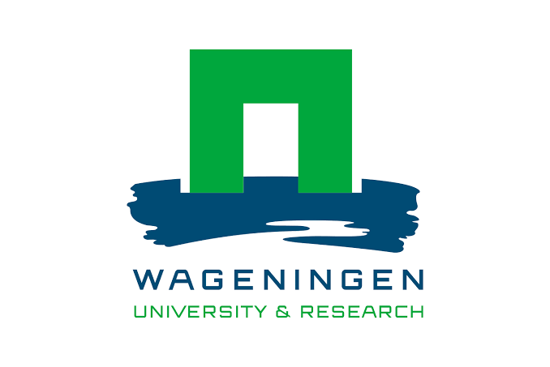
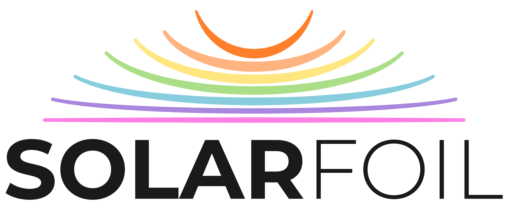
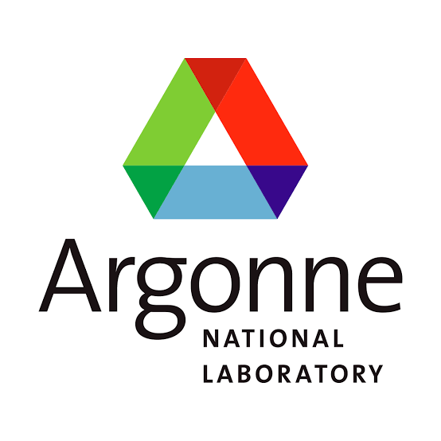
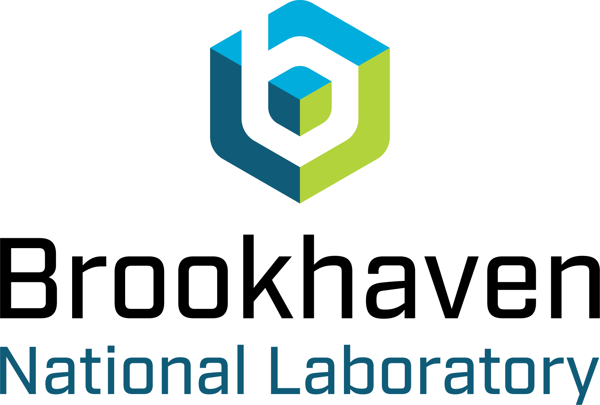

Our research is inherently collaborative. We work across disciplines and institutions to bring together nanocrystal synthesis, self-assembly, photophysics, advanced characterization, and computational modelling to foster implementation into useful technologies.

These collaborations expand the range of questions we can address and give students access to an international network of complementary expertise.

## Italy

::: {.institution-card}

::: {.institution-logo}
{fig-alt="Università degli Studi di Palermo logo"}
:::

::: {.institution-content}

### Università degli Studi di Palermo

#### Fabrizio Messina & Alice Sciortino

Our collaboration focuses on advanced optical characterization of luminescent nanomaterials, connecting nanoscale structure with collective optical behaviour in hierarchical assemblies.

[Visit institutional profile](https://photo2n.unipa.it/){target="_blank"}

:::

:::

## Europe

::: {.institution-card}

::: {.institution-logo}
{fig-alt="University of Amsterdam logo"}
:::

::: {.institution-content}

### University of Amsterdam

#### Peter Schall

Our collaboration investigates colloidal interactions, self-assembly, and phase behaviour, connecting experiments with concepts from soft condensed matter and statistical physics.

[Visit group website](https://peterschall.de/){target="_blank"}

:::

:::

::: {.institution-card}

::: {.institution-logo}
{fig-alt="Wageningen University and Research logo"}
:::

::: {.institution-content}

### Wageningen University & Research

#### Thomas Kodger

We collaborate on soft materials, colloidal systems, microfluidics, and experimental strategies for controlling particle interactions and assembly under well-defined conditions.

[Visit group website](https://www.wur.nl/en/chair-groups/biomolecular-sciences/physical-chemistry-and-soft-matter){target="_blank"}

:::

:::

::: {.institution-card}

::: {.institution-logo}
{fig-alt="Friedrich-Alexander-Universität Erlangen-Nürnberg logo"}
:::

::: {.institution-content}

### Friedrich-Alexander-Universität Erlangen-Nürnberg

#### Michael Engel

Our collaboration combines experiments with computational and theoretical modelling to understand crystallization, phase selection, and structural complexity in nanocrystal and colloidal assemblies.

[Visit group website](https://engellab.de/){target="_blank"}

:::

:::

::: {.institution-card}

::: {.institution-logo}
{fig-alt="SolarFoil logo"}
:::

::: {.institution-content}

### SolarFoil

#### Arnon Lesage

Our collaboration connects light-emitting nanomaterials and photonic design with scalable spectral-conversion technologies and industrial applications.

[Visit company website](https://www.solar-foil.com/home){target="_blank"}

:::

:::

## United States

::: {.institution-card}

::: {.institution-logo}
{fig-alt="University of Pennsylvania logo"}
:::

::: {.institution-content}

### University of Pennsylvania

#### Christopher B. Murray and Cherie R. Kagan

We collaborate on colloidal nanocrystal synthesis and assembly, with an emphasis on controlling particle size, shape, composition, and interactions to create complex mesostructured materials.

[Visit group website (Murray)](https://web.sas.upenn.edu/cbmurray/){target="_blank"}
[Visit group website (Kagan)](https://kagan.seas.upenn.edu/){target="_blank"}

:::

:::

::: {.institution-card}

::: {.institution-logo}
{fig-alt="Johns Hopkins University logo"}
:::

::: {.institution-content}

### Johns Hopkins University

#### Thi Vo

We collaborate on theory and computational modelling of nanoparticle self-assembly, including the effects of particle shape, surface ligands, directional interactions, and thermodynamic driving forces.

[Visit group website](https://vogroup.wse.jhu.edu/){target="_blank"}

:::

:::

::: {.institution-card}

::: {.institution-logo}
{fig-alt="Argonne National Laboratory logo"}
:::

::: {.institution-content}

### Argonne National Laboratory

#### Benjamin T. Diroll

Our collaboration uses time-, temperature-, and pressure-resolved optical spectroscopy and complementary structural characterization to study colloidal nanocrystals and their assemblies.

[Visit institutional profile](https://www.anl.gov/profile/benjamin-t-diroll){target="_blank"}

:::

:::

::: {.institution-card}

::: {.institution-logo}
{fig-alt="Brookhaven National Laboratory and Center for Functional Nanomaterials logo"}
:::

::: {.institution-content}

### Center for Functional Nanomaterials  
### Brookhaven National Laboratory

#### Esther H. R. Tsai

We collaborate on advanced X-ray scattering, imaging, and data-analysis approaches for resolving the structure and evolution of complex nanomaterial assemblies.

[Visit institutional profile](https://www.bnl.gov/staff/etsai){target="_blank"}

:::

:::

::: {.collaboration-note}

## Interested in collaborating?

We welcome collaborations that combine complementary expertise in nanocrystal synthesis, self-assembly, scattering, spectroscopy, microfluidics, computation, and photonics.

[Contact us](mailto:emanuele.marino@unipa.it){.btn .btn-primary}

:::