::: {.hero-logo}

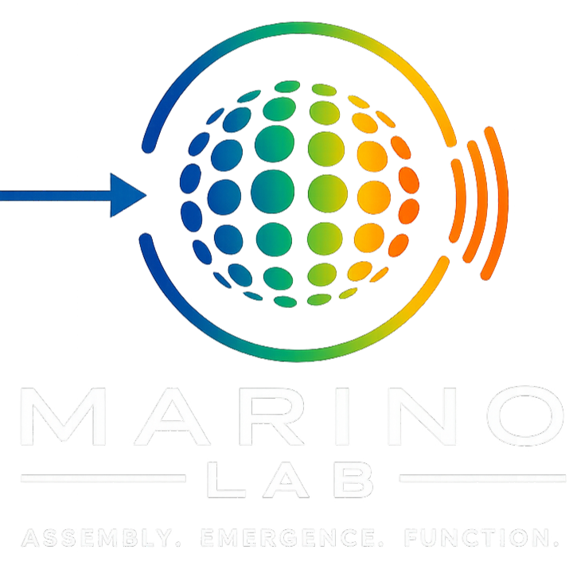{width=320}

:::

## Designing materials from nanoscale building blocks

We design materials from self-assembled nanoparticles to create new collective properties and functions.

By controlling how nanoscale building blocks organize, we explore how structure gives rise to emergent behavior, light–matter interaction, and responsive materials.

{fig-align="center" width="75%"}

*From disordered building blocks to ordered materials with emergent properties.*

---

## Featured highlights

```{=html}
<div class="hero-slideshow">

  <div class="slide active">
    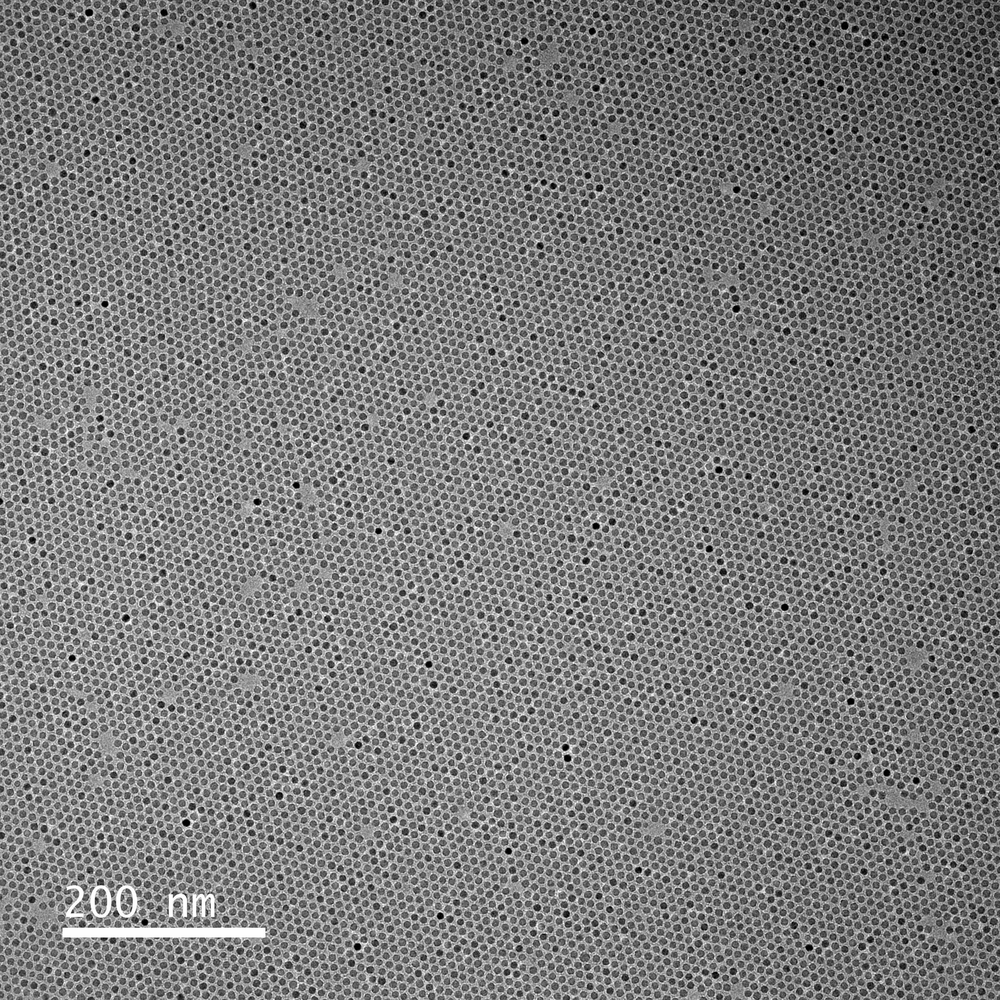
    <div class="slide-caption">Monolayer of superparamagnetic iron oxide nanocrystals.</div>
  </div>

<div class="slide">
    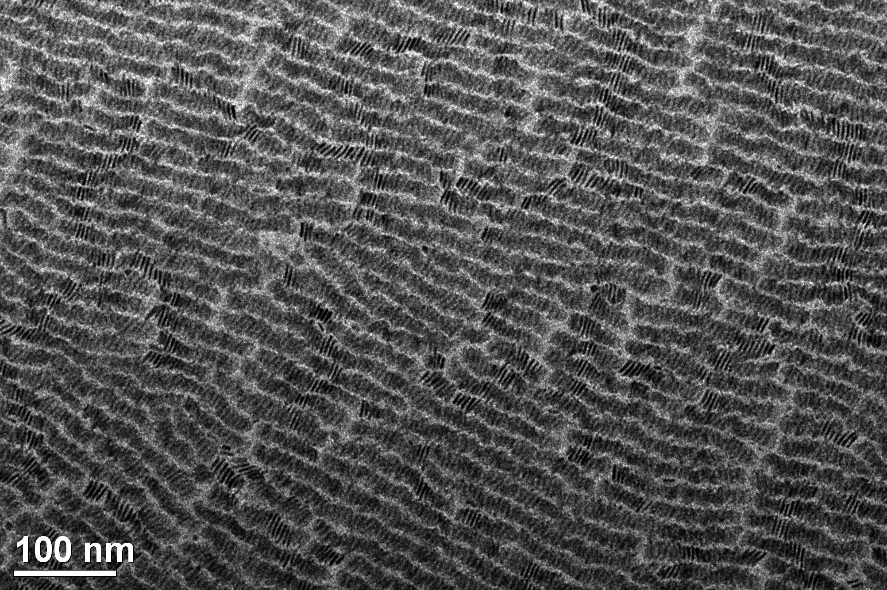
    <div class="slide-caption">Nanowires of assembled semiconductor cadmium selenide nanoplatelets.</div>
  </div>

  <div class="slide">
    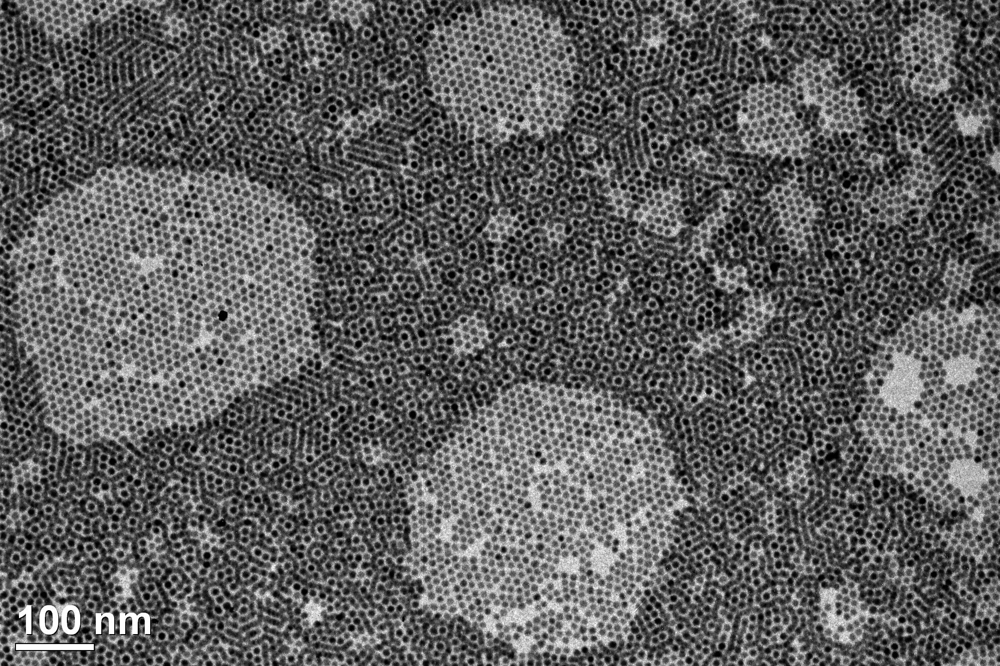
    <div class="slide-caption">Monolayer and bilayer of semiconductor cadmium selenide / cadmium sulfide core/shell nanocrystals.</div>
  </div>

  <div class="slide">
    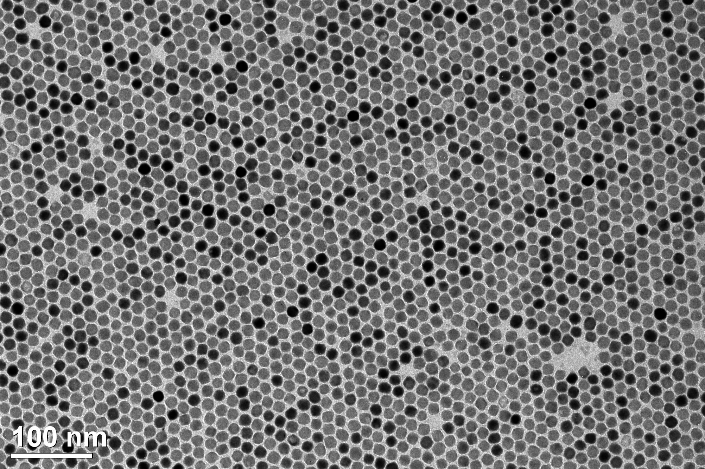
    <div class="slide-caption">Monolayer of infrared plasmonic fluorine-indium co-doped cadmium oxide nanocrystals.</div>
  </div>

  <div class="slide">
    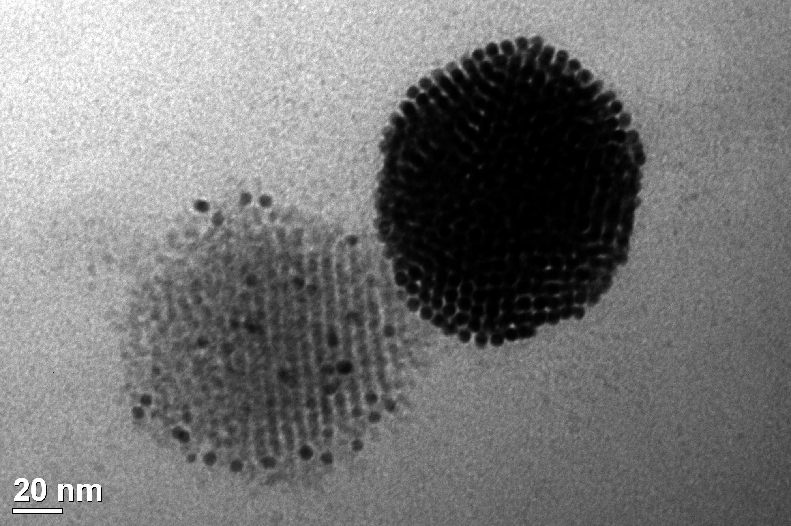
    <div class="slide-caption">Nanoscale phase separation of crystals of gold and lead sulfide nanocrystals.</div>
  </div>

  <div class="slide">
    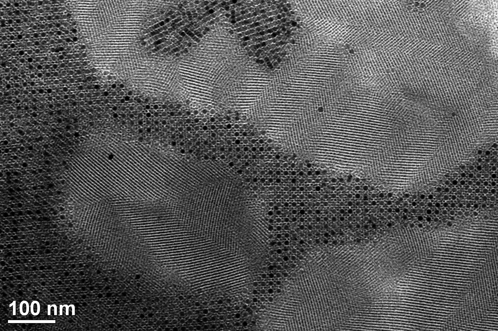
    <div class="slide-caption">Binary magneto-semiconductor crystal pathway on a unary semiconductor crystal sea.</div>
  </div>

  <div class="slide">
    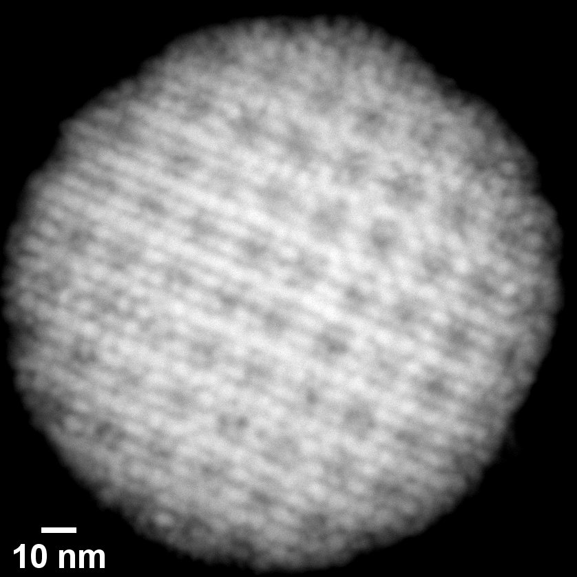
    <div class="slide-caption">Binary plasmonic-semiconductor crystalline supraparticle.</div>
  </div>

  <div class="slide">
    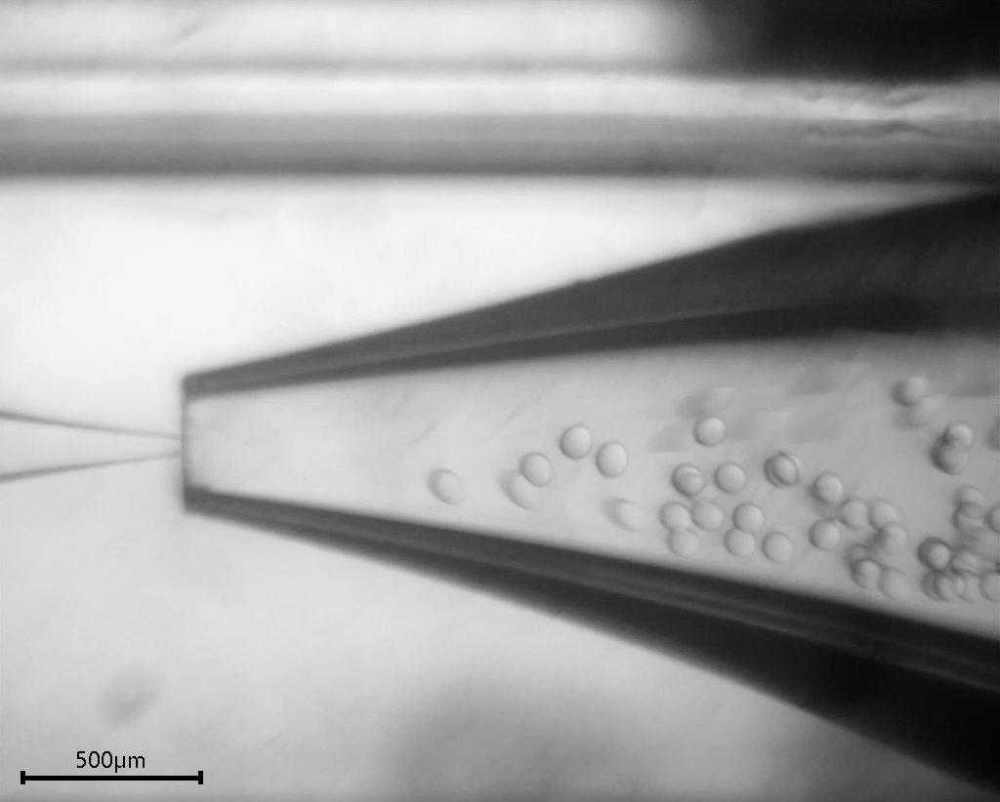
    <div class="slide-caption">Microfluidic production of monodisperse droplets containing nanocrystals.</div>
  </div>

  <div class="slide">
    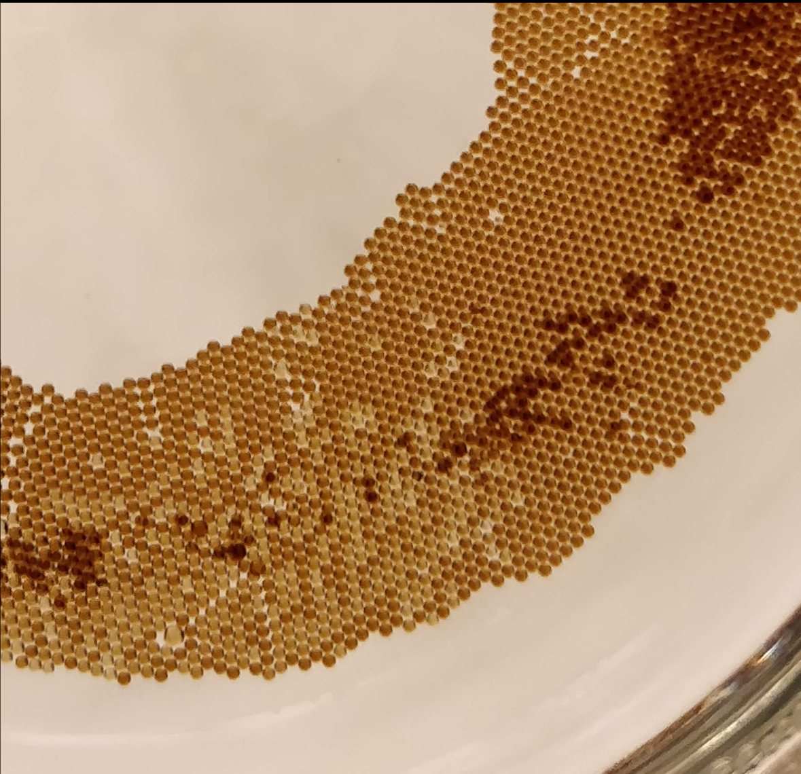
    <div class="slide-caption">Monodisperse droplets containing nanocrystals.</div>
  </div>

<div class="slide">
    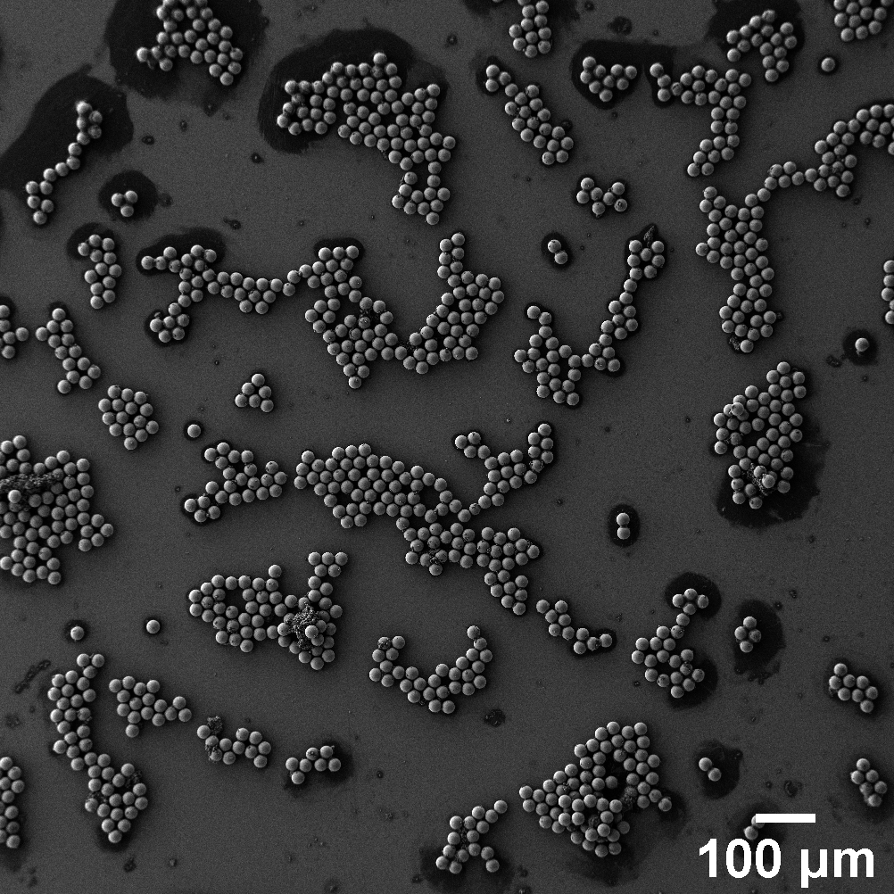
    <div class="slide-caption">Microfluidic generation of optical resonators.</div>
  </div>

</div>

<script>
document.addEventListener("DOMContentLoaded", function () {
  const slides = document.querySelectorAll(".hero-slideshow .slide");
  let current = 0;

  if (slides.length > 0) {
    setInterval(() => {
      slides[current].classList.remove("active");
      current = (current + 1) % slides.length;
      slides[current].classList.add("active");
    }, 4000);
  }
});
</script>
```

---

## Research

::: columns
::: column
### Assembly

Understanding how nanoparticles organize into ordered materials and how different assembly pathways lead to distinct structures.
:::

::: column
### Light–matter interaction

Designing microscale resonators that confine and amplify light, enabling lasing and sensing at extremely small scales.
:::

::: column
### Responsive materials

Creating hierarchical materials that adapt their structure and properties in response to external stimuli.
:::
:::

---

## Why this matters

By linking structure to function across length scales, we aim to design materials with new capabilities for sensing, energy, and adaptive systems—where properties emerge from organization rather than individual components.

---

## Join us

We are always interested in motivated students who enjoy hands-on work, open-ended problems, and building new materials from the ground up.

If you are interested, explore our research and get in touch.