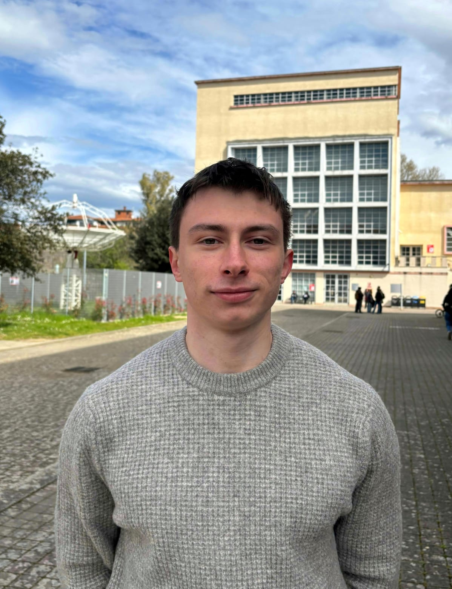

## Faculty

::: {.columns}
::: {.column width="25%"}
{width=180px}
:::

::: {.column width="75%"}
### Prof. Emanuele Marino

**Principal Investigator**

Dr. Emanuele Marino is a physicist exploring how nanoscale organization can be harnessed to create materials with emergent optical and electronic functionality. His research centers on nanocrystal self-assembly as a route to programmable superstructures for photonics, optoelectronics, and energy applications.

By combining concepts from soft matter physics with advanced materials design, his work seeks to control light–matter interactions through structure, enabling new paradigms in superlattice engineering. He has authored over 30 peer-reviewed publications, including papers in *Nature*, *Science*, and *Nano Letters*, with several featured on journal covers.

Dr. Marino has secured competitive national and European funding (including Horizon Europe) and has conducted experiments at major synchrotron facilities in France and the United States. He has held research appointments at the University of Pennsylvania and the University of Amsterdam and serves as a reviewer for leading journals and funding agencies.

Email: [emanuele.marino@unipa.it](mailto:emanuele.marino@unipa.it)
:::
:::

---

## PhD Students

::: {.columns}
::: {.column width="25%"}
{width=180px}
:::

::: {.column width="75%"}
### Saranya Subramanian

**PhD Student**

Saranya joined the group as a PhD student in 2024. She holds a MSc in chemistry from India. Her focus is to explore non-toxic nanocrystals as solar shapers to improve photosynthetic efficiency of plants. She is particularly interested in supraparticle assembly and enjoys exploring its possibilities for photonics applications. She brings an enthusiastic energy to the group, as well as freshly prepared home-cooked delicacies on special occasions. 

Email: [saranya.subramanian@unipa.it](mailto:saranya.subramanian@unipa.it)
:::
:::

---

## Alumni

::: {.columns}
::: {.column width="25%"}
{width=180px}
:::

::: {.column width="75%"}
### Francesco Minutella

**BSc Student**

Francesco completed his Bachelor's thesis at the University of Palermo, focusing on the synthesis and characterization of CuInS₂/ZnS nanocrystals.

He is currently pursuing his MSc at the University of Pisa, Italy.
:::
:::

::: {.columns}
::: {.column width="25%"}
{width=180px}
:::

::: {.column width="75%"}
### Hira Aman

**MSc Student**

Hira completed her Master’s thesis at the University of Palermo, focusing on the solvent-dependent optical properties and aggregation behavior of Cd₃₇S₂₀ nanoclusters using advanced spectroscopic techniques.

She is currently pursuing her PhD at the University of Reggio Calabria, Italy.
:::
:::

---
