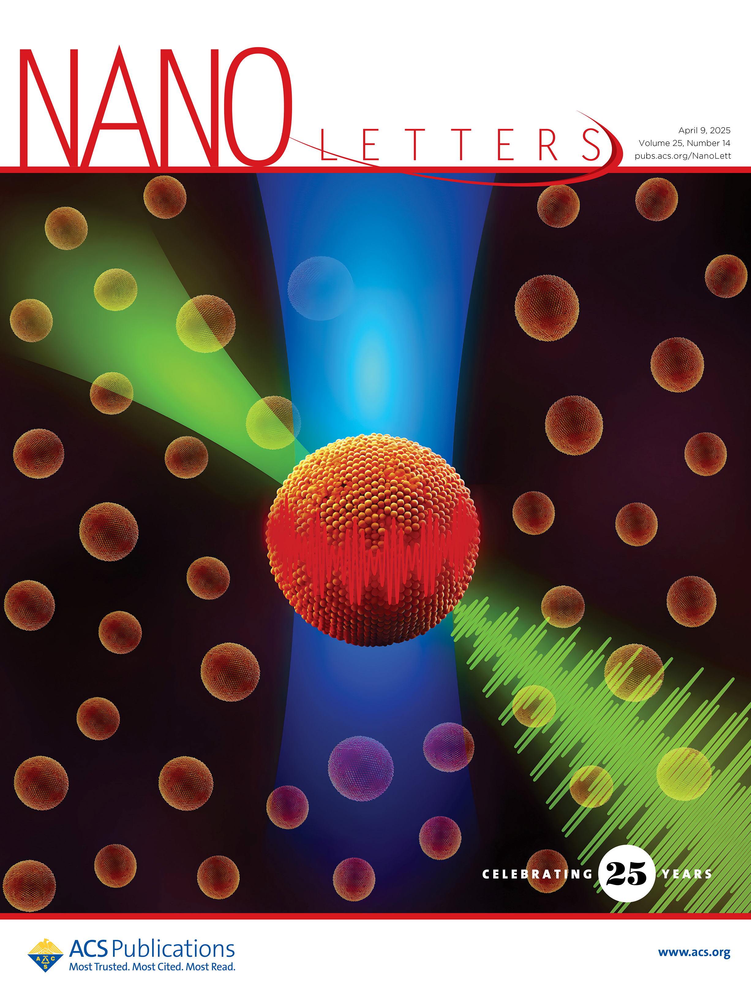
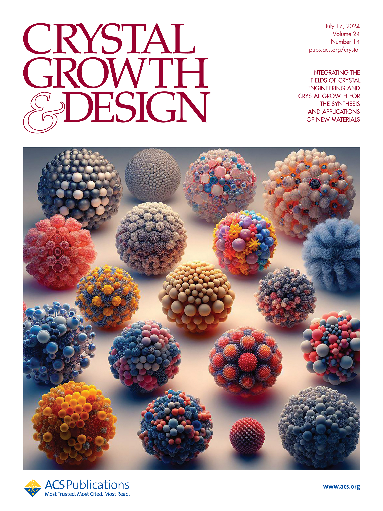
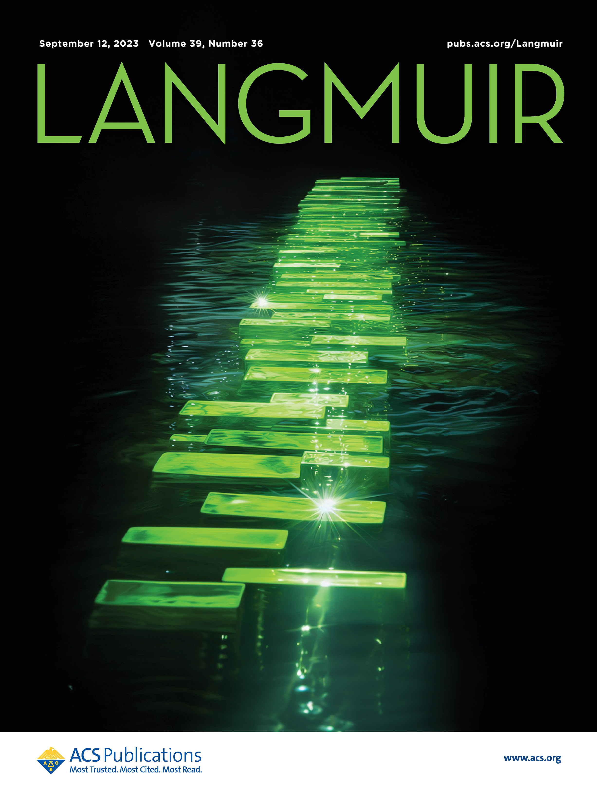
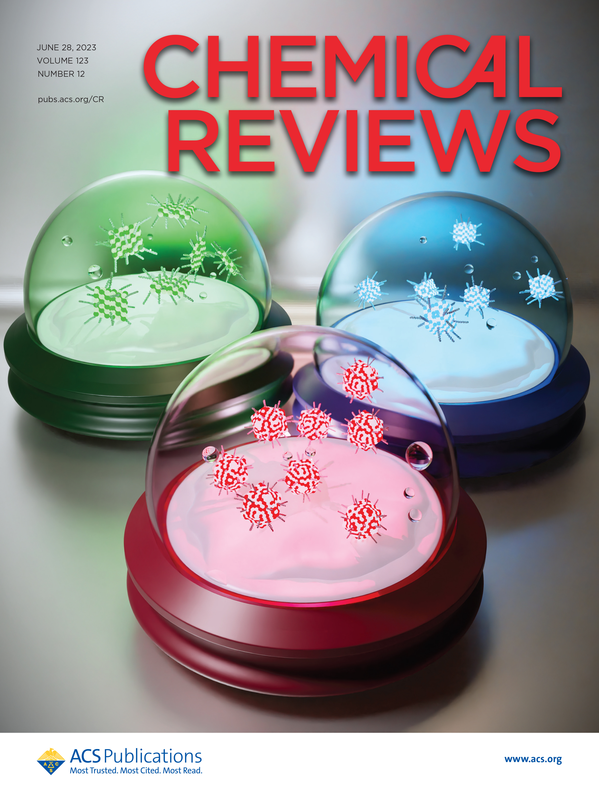
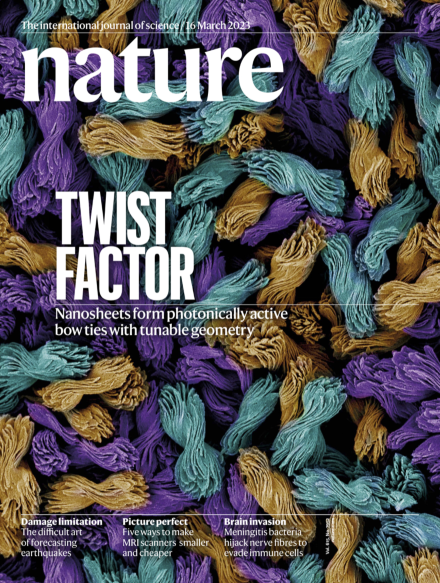
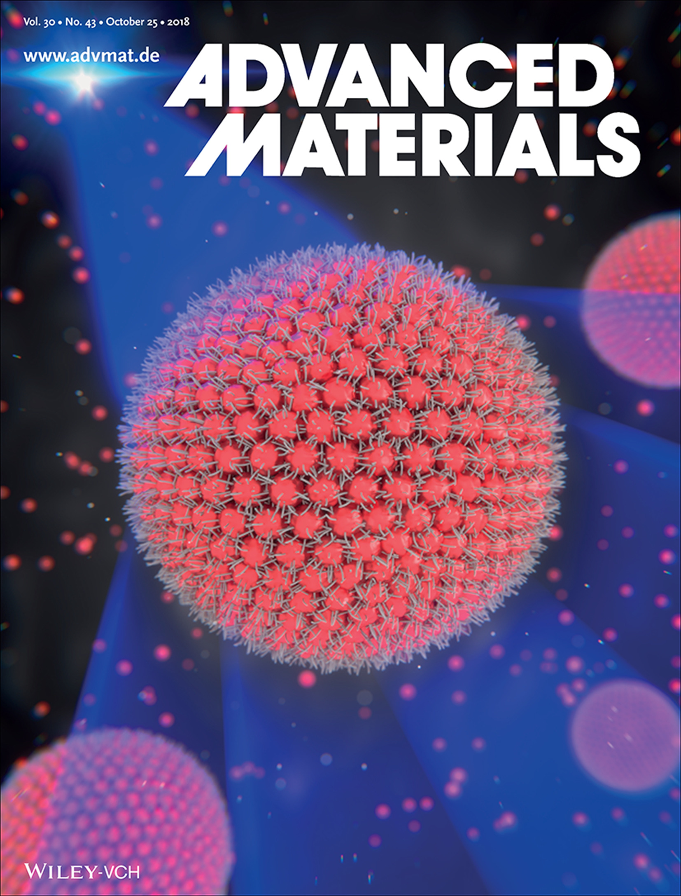

# Publications

## Cover images

```{=html}
<div class="cover-carousel">

  <a class="cover-item" href="https://pubs.acs.org/doi/full/10.1021/acs.nanolett.5c00643" target="_blank">
    
    <div class="cover-label"><em>Nano Letters</em> (2025)</div>
  </a>

  <a class="cover-item" href="https://pubs.acs.org/doi/full/10.1021/acs.cgd.4c00260" target="_blank">
    
    <div class="cover-label"><em>ACS Crystal Growth & Design</em> (2024)</div>
  </a>

  <a class="cover-item" href="https://pubs.acs.org/doi/full/10.1021/acs.langmuir.3c00933" target="_blank">
    
    <div class="cover-label"><em>Langmuir</em> (2023)</div>
  </a>

  <a class="cover-item" href="https://pubs.acs.org/doi/abs/10.1021/acs.chemrev.3c00097" target="_blank">
    
    <div class="cover-label"><em>Chemical Reviews</em> (2023)</div>
  </a>

  <a class="cover-item" href="https://www.nature.com/articles/s41586-023-05733-1" target="_blank">
    
    <div class="cover-label"><em>Nature</em> (2023)</div>
  </a>

  <a class="cover-item" href="https://advanced.onlinelibrary.wiley.com/doi/abs/10.1002/adma.201803433" target="_blank">
    
    <div class="cover-label"><em>Advanced Materials</em> (2018)</div>
  </a>

</div>