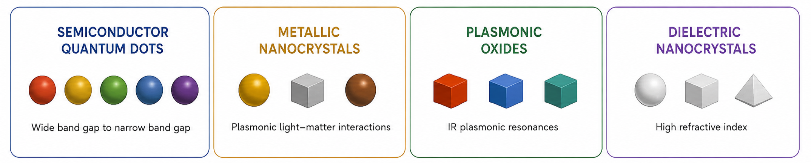
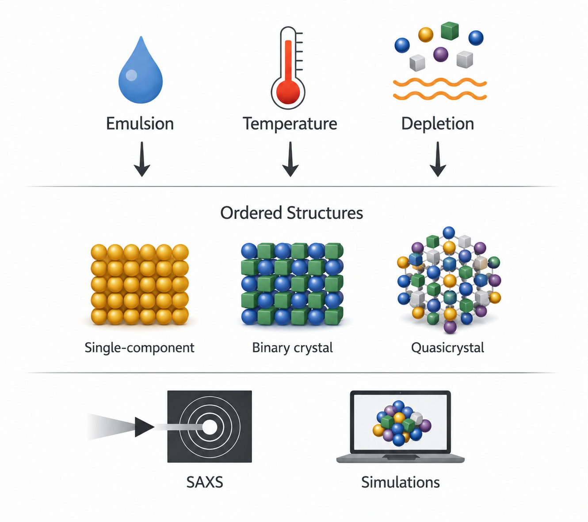
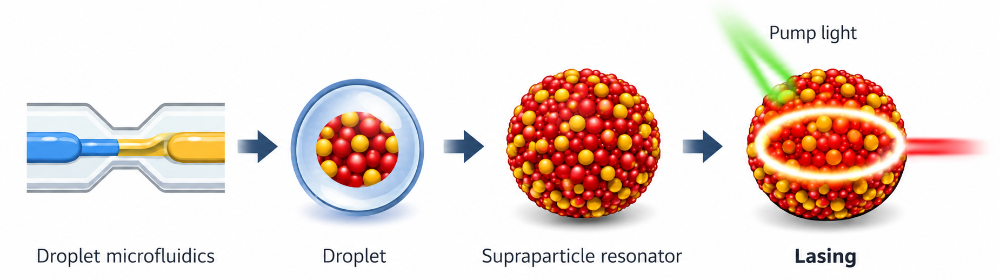
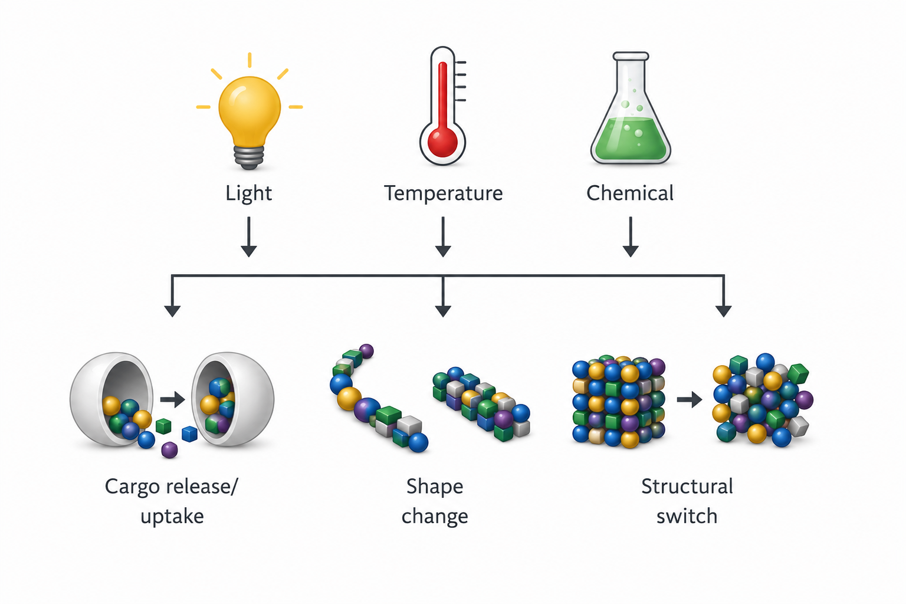

## Building Artificial Materials from Nanocrystals

Over the past decades, researchers have learned how to synthesize nanocrystals with an extraordinary diversity of sizes, shapes, and compositions, spanning much of the periodic table. Each of these building blocks comes with its own set of physical properties.

---

{fig-align="center"}

*Families of colloidal nanocrystals and their physical properties.*

---

**What happens when these nanocrystals are combined into larger, organized structures?**

We are interested in using self-assembly to fabricate artificial materials with **emergent properties**: properties that do not exist in the individual components, but arise *only* when nanocrystals are brought together in a precise manner.

We aim to understand and harness these effects to design new materials that can help address major challenges in energy, climate, and sustainability.

---

{fig-align="center" width="75%"}

*Self-assembly can transform disordered nanoparticle building blocks into ordered superlattices with emergent collective properties.*

---

## Research directions

### Understanding how nanoparticles assemble into ordered materials

If self-assembly is to become a true fabrication strategy, we need to understand how individual nanoparticles organize into larger structures.

We study this process across a range of systems, including emulsion-templated assembly, temperature-driven assembly, and depletion-driven assembly. To follow these processes in real time, we use **small-angle X-ray scattering (SAXS)**, both at synchrotron facilities such as ESRF and NSLS-II and with in-house instruments. These experiments are combined with **molecular dynamics simulations** to connect observed structures with the underlying physical mechanisms.

A central focus of this work is understanding how ordered phases emerge, including single-component crystals, binary nanoparticle crystals, and quasicrystalline structures.

---

{fig-align="center" width="75%"}

*Different assembly pathways can guide nanoparticles toward distinct ordered phases, which we study using in situ SAXS and molecular dynamics simulations.*

---

### Light--matter interaction in self-assembled microresonators

We investigate how self-assembled structures can control and amplify light.

Using **droplet microfluidics**, we fabricate microscale resonators based on colloidal quantum dots, leveraging a source--sink approach recently developed and patented in our lab. These spherical dielectric structures can confine light along their surface, creating a feedback loop through repeated cycles of spontaneous and stimulated emission.

This enables phenomena such as **lasing in extremely small volumes**, potentially down to the scale of a red blood cell.

We study how resonator shape, composition, and morphology affect light--matter interactions, with the goal of developing ultra-small lasers able to monitor their environment with high precision and provide optical, thermal, or mechanical feedback.

---

{fig-align="center" width="100%"}

*Droplet microfluidics enables the formation of self-assembled colloidal quantum dot supraparticle resonators that confine and amplify light, supporting lasing as well as sensing and feedback.*

---

### Responsive and hierarchical materials

We are interested in developing hierarchical materials that can undergo sharp or gradual transitions in structure and properties in response to specific energy inputs.

These systems are designed to respond on demand by releasing or uptaking cargo, changing shape, melting or crystallizing, or transitioning between distinct structural states. More broadly, we explore how hierarchical organization can produce complex dynamic behaviors and new forms of responsive matter.

---

{fig-align="center" width="75%"}

*Hierarchical materials respond to external stimuli (light, temperature, chemical environment) through cargo exchange, shape change, and structural switching.*

---