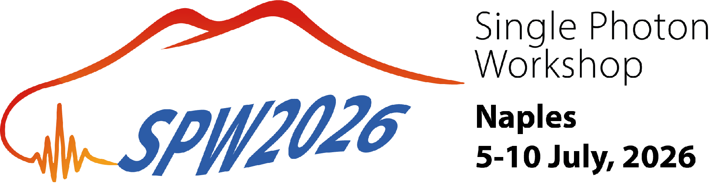
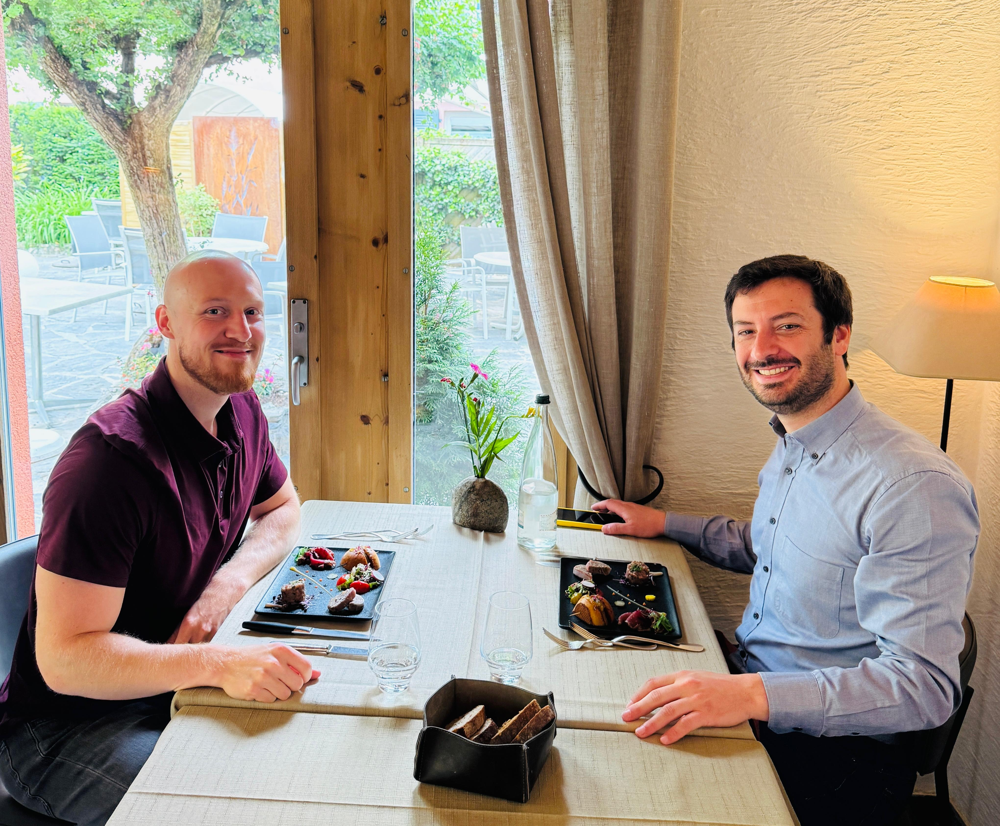
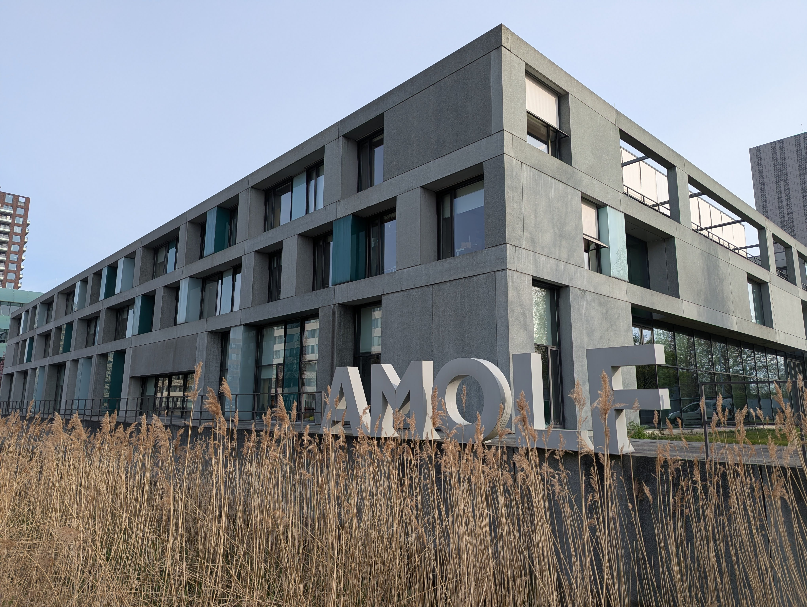
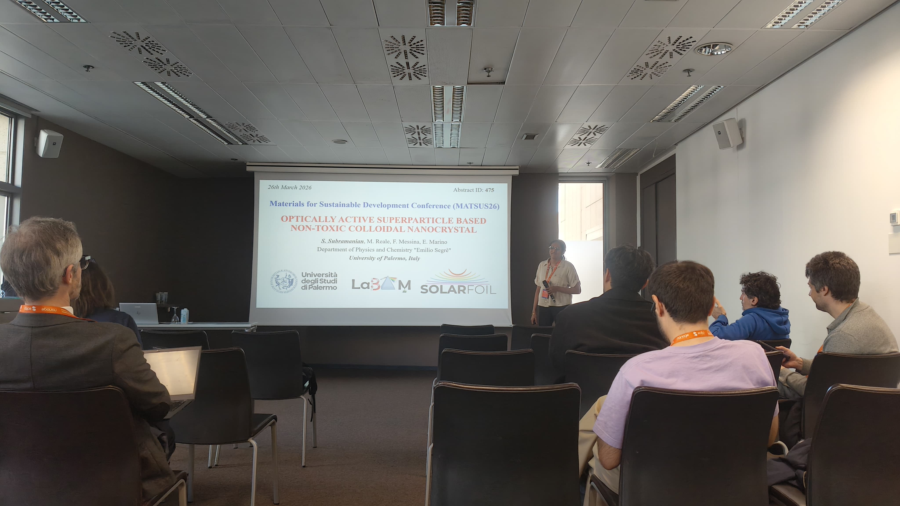
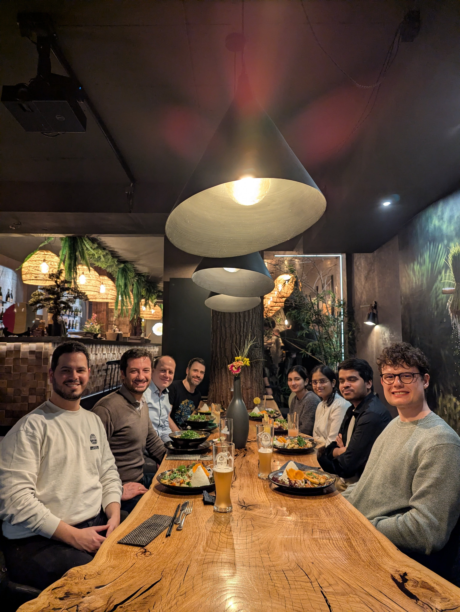
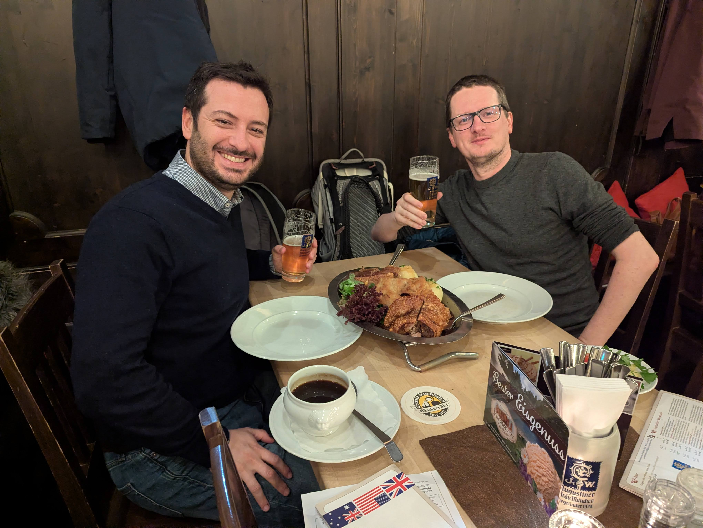

Where to meet *on campus*:

Our laboratories are located within the historical campus of the University of Palermo in Via Archirafi 36, 90123 Palermo (Pa), Italy. We share our lab space with the [LaBAM group](https://labam.unipa.it/). Our facilities include two fully equipped wet labs and several laser labs, allowing for synthesis, assembly, and optical characterization of nanostructures.

---

Where to meet *around the world*:

**September 2026**: Emanuele will attend the 112th Meeting of the Italian Physical Society (SIF). 

Event: Italian Physical Society Meeting (SIF-2026), University of Florence, Florence, Italy.

{fig-align="center" width="70%"}

---

**July 2026**: Emanuele will attend the Single Photon Workshop (SPW2026). 

Event: Single Photon Workshop (SPW2026), University of Napoli Federico II, Naples, Italy.

{fig-align="center" width="70%"}

---

**May 2026**: Emanuele will visit the group of Sascha Feldmann at EPFL. 

Event: Invited Energy Seminar Series Lecture, EPFL, Lausanne, Switzerland.

{fig-align="center" width="70%"}

---

**April 2026**: Emanuele will visit the group of Bruno Ehrler at Amolf. 

Event: Invited Seminar, Amolf Institute, Amsterdam, The Netherlands.

{fig-align="center" width="70%"}
---

**March 2026**: Saranya will attend the Materials for Sustainable Development Conference (MATSUS26) to deliver her first talk. 

Event: Materials for Sustainable Development Conference (MATSUS26), Barcelona, Spain.

{fig-align="center" width="70%"}

---

**February 2026:** Emanuele will visit the group of Michael Engel at FAU. 

Event: Invited Seminar, Institute for Multiscale Simulation, Friedrich-Alexander-Universität Erlangen-Nürnberg, Erlangen, Germany.

{fig-align="center" width="70%"}

---

**January 2026:** Emanuele will visit the group of Quinten Akkerman at LMU. 

Event: Invited Soltech Seminar, Faculty of Physics, Ludwig-Maximilians-Universität München, Munich, Germany.

{fig-align="center" width="70%"}